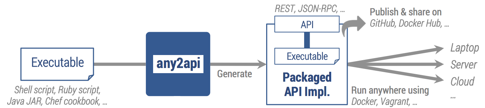
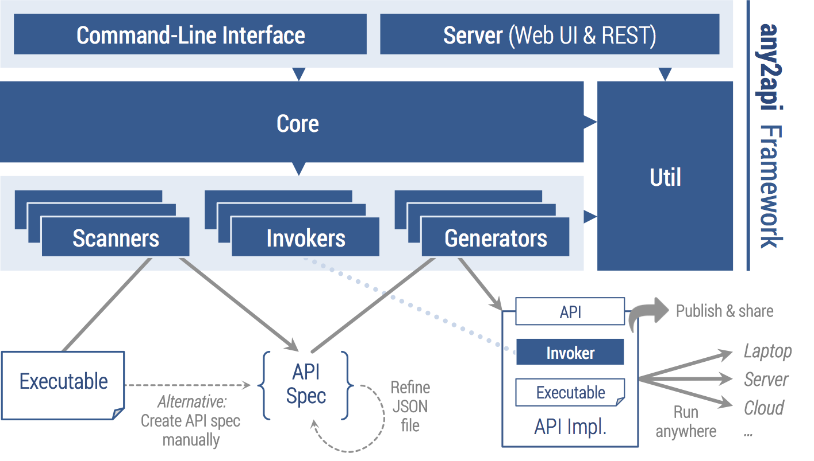
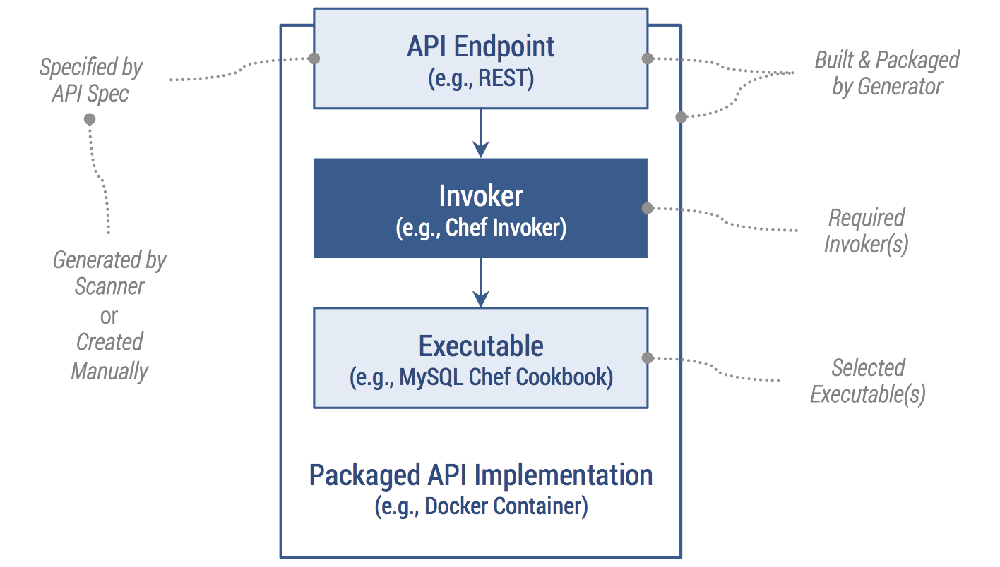

**Legacy, not maintained anymore. Check [any2api.org](http://any2api.org) for recent developments.**

----

# About

Auto-generate containerized APIs for any executable.

* [What is any2api?](#what-is-any2api) &ndash; [Why use any2api?](#why-use-any2api) &ndash; [Use Cases](#use-cases)
* [Architecture and Design](#architecture-and-design)

----

## What is any2api?

The *any2api* framework lets you wrap arbitrary executables (scripts, Chef cookbooks, Juju charms, compiled programs, etc.) by auto-generating containerized and portable APIs. This is to ease integration and orchestration of different kinds of executables, for instance, to implement automated deployment processes on top of these executables.

It's a fully modular and extensible *APIfication* framework. [Modules](/modules) are shipped as [npm modules](https://www.npmjs.org/browse/keyword/any2api), but they do not have to be implemented in JavaScript/Node.js. Pick your favorite language/technology to build great modules. Currently, [any2api-cli](https://github.com/any2api/any2api-cli) provides a [command-line](/cli-server) interface; a web-based user interface is planned.

## Why use any2api?

APIs are great to expose and utilize functionality programmatically. Especially language-agnostic APIs such as Web APIs (HTTP/REST and others) simplify the integration and orchestration of applications/components: completely different technology stacks could be used behind an API, without the API consumer having to consider the implementation details in the background. This is the idea of abstraction.

Today, most APIs are developed individually. This is supported by a huge variety of frameworks and libraries, many of them available as open-source software. However, in some cases there are serious issues with this approach:

* **Scale:** Functionality may be scattered across a large number of individual executables (of different kinds), so manually creating an individual API for each of them doesn't scale. The other way creating a huge, magic, monolithic piece of middleware to deal with all kinds of executables is hard work, hard to maintain, and doesn't scale neither.
* **Missing expertise:** Some developers or scientists may be comfortable with creating simple executables (e.g., Python scripts) and run them using a command-line interface; the expertise for exposing the functionality through a proper (Web-based) API may be missing. However, reusing or even integrating the functionality (e.g., collaboration among scientists) is a hard piece of work without proper APIs.
* **Growing codebase:** By developing an API for a piece of code to expose its functionality, the codebase that needs to be maintained grows without adding value to the core functionality. Consequently, maintenance gets complicated, especially if API development is not a core competence in the given environment.
* **Fixed type of API:** When manually developing an individual API, its type is fixed (REST or JSON-RPC or WSDL/SOAP or you name it). If later on another or an additional type of API is required (e.g., another orchestration mechanism is used), it needs to be implemented in addition. For this, not only additional time and expertise is required, but also the codebase grows and gets harder to maintain.

These issues are tackled by the any2api approach: generate and re-generate arbitrary APIs for your code instead of individually developing them. Don't worry about required expertise and a growing codebase that has to be maintained manually.

Finally, any2api packages generated API implementations in a portable, containerized manner (Docker container, Vagrant VM), so it can potentially be hosted anywhere (dev laptop, on-premise server, cloud).

## Use Cases

#### DevOps artifacts

The DevOps community shares a huge number and variety of reusable open-source artifacts to automate application deployment and operations.
Some examples are <a href="https://supermarket.chef.io/cookbooks">Chef cookbooks</a>, <a href="https://jujucharms.com">Juju charms</a>, <a href="https://forge.puppetlabs.com">Puppet modules</a>, <a href="https://galaxy.ansible.com/explore">Ansible roles</a>, <a href="http://docs.saltstack.com/en/latest/salt-modindex.html">Salt modules</a>, <a href="https://registry.hub.docker.com">Docker containers</a>, <a href="https://atlas.hashicorp.com/boxes/search">Vagrant boxes</a>, and many more.
The any2api framework can be used to wrap such artifacts/executables as APIs to easily reuse and orchestrate what great open-source ecosystems offer.
You don't have to deal with low-level, technical details of how to use Chef, Ansible, Puppet, you name it.

#### E-Science

Many scientists working in the field of e-science and cyberinfrastructure implement executables in Python, C, Fortran, and other languages to run scientific calculations and simulations.
Sharing and integrating such executables can be a powerful way to combine results of different scientific areas.
However, some scientists refuse to share these executables because of non-disclosure (e.g., included algorithms are the core of their current research and strongly private).
By wrapping scientific executables using any2api, the generated API implementation can be hosted on a trusted server, only sharing the API endpoint address with peer scientists.
Furthermore, the generated API for a particular executable hides the technical complexity to use it; as an example you can interact with a Fortran program through a REST API with your Web browser conveniently, without even knowing that it's Fortran code running in the background.

#### Microservices

With [microservices](http://martinfowler.com/articles/microservices.html) getting increasingly popular as an architecture paradigm, the any2api framework can be used to build systems that follow this paradigm.
The basic idea is to develop highly specialized and scoped components (independently maintained and deployable) to expose functionality as services (APIs) that make a complex system by bringing them together.
This is in contrast to building monolithic systems that don't scale and are hard to change and maintain.
Some components could be implemented as executables in an arbitrary language.
Then, any2api can be used to generate API implementations, which are independently deployable entities in the sense of microservices.

#### API endpoint = executable

An executable doesn't have to be a file or a code snippet. An existing API endpoint hosted by an external party could also be considered as an executable. Consequently, the any2api framework can be used to translate between different protocols (e.g., wrap existing WebSocket endpoint by HTTP) or different communication paradigms (e.g., wrap RPC by REST).

## Architecture and Design

The architecture and design of the any2api framework as well as the associated workflow are fairly simple. As shown in the following diagram (upper part), all user interactions are performed using a corresponding interface. The [command-line](/cli-server) interface is the most powerful option. In addition, a web-based user interface is planned to further simplify the usage of the framework. All interfaces use the *core* and *util* modules to interact with available scanners, invokers, and generators.

The lower part of the architecture diagram outlines the logical workflow with the framework. An executable (e.g., a Chef cookbook) is analyzed by a corresponding scanner module (e.g., a Chef scanner). The scanner produces an API spec, rendered as JSON file. This file can be manually refined on demand. Eventually, the API spec serves as input for a corresponding generator module (e.g., REST API generator) to build a packaged, self-contained API implementation. Beside the selected executable(s) and the generated API endpoint, the package includes all invokers that are required to run the executables. Currently, each API implementation is packaged as npm module, Docker container, and Vagrant VM, so you can simply choose between npm, Docker, and Vagrant to run the API implementation anywhere (your laptop, your server, somewhere in the cloud).

The diagram above shows the structure of a generated API implementation in more detail.
In the following a handful of key terms are explained in the context of the any2api framework.

* **Executable:** Anything that can be executed such as a code snippet or a script (e.g., Shell, Python, Ruby), a binary (e.g., compiled program), or a configuration definition (e.g., Chef cookbook). An executable typically expects inputs and produces outputs through different channels (files, command-line arguments, environment variables, stdin, stdout, etc.).

* **Scanner:** Specialized module to scan an executable, including its metadata (e.g., a Chef cookbook with its <code>metadata.json</code> file). Therefore, the input of a scanner is an executable, the output is an <a href="/apispec">API spec</a>. Available scanners are listed on the <a href="/modules">modules page</a>.

* **API Spec:** Describes the interface (currently in JSON) of one or multiple executables, potentially different kinds of executables. Details are explained on the <a href="/apispec">API spec page</a>.

* **Generator:** Specialized module to generate and package an <em>API implementation</em> for all executables described in the given <em>API spec</em>. Therefore, the input of a generator is an API spec, the output is an API implementation. Available generators are listed on the <a href="/modules">modules page</a>.

* **API Implementation:** Self-contained, portable package containing the API spec, all executables described in the API spec, all required <em>invokers</em> and the generated implementation of the API endpoint.

* **Invoker:** Specialized module to invoke a certain kind of executable (e.g., Ruby script, Java JAR file, Chef cookbook) at runtime. Invokers are packaged with the corresponding executables as part of an API implementation. Available invokers are listed on the <a href="/modules">modules page</a>.

### Read next

[Getting started](getstarted.md)
